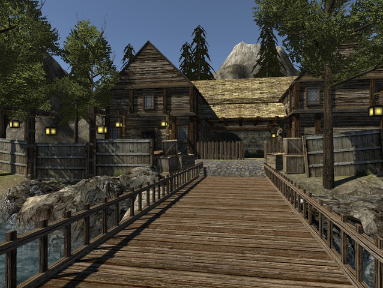
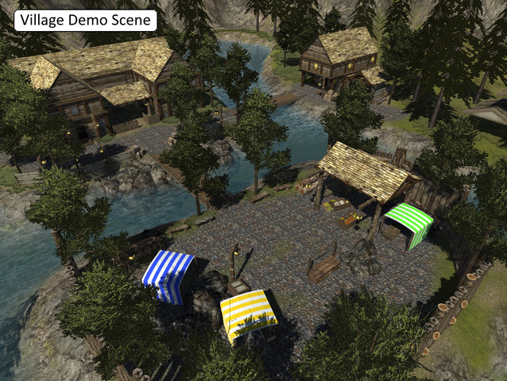
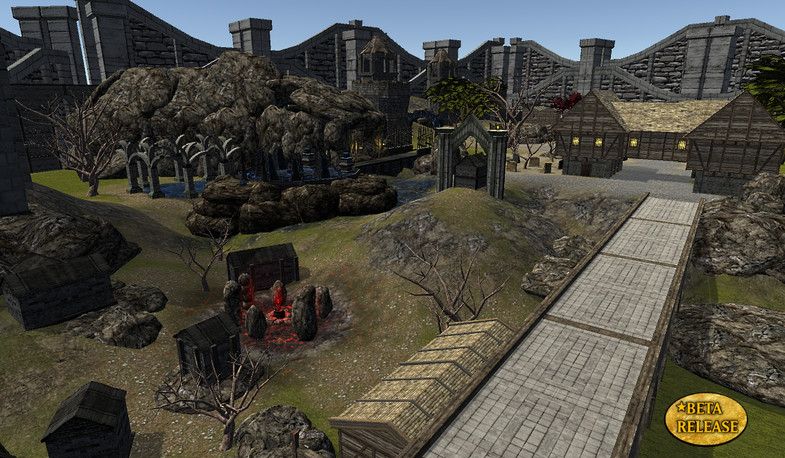
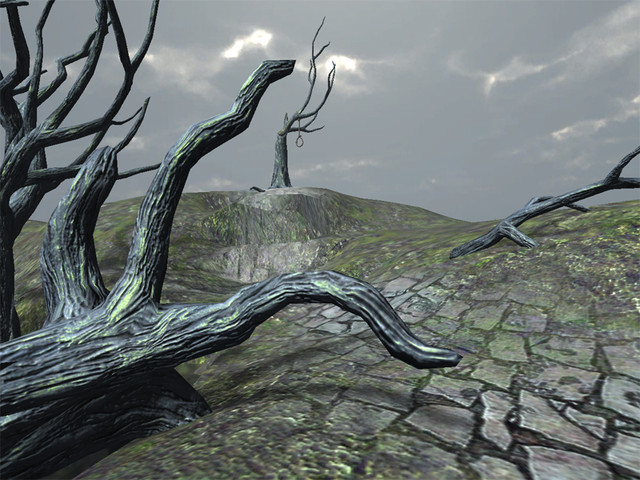

# CST238
Zommo, A subwolfer studios production.

Logo  
  
Dead trees in zone
 
 

<B> Description </B>  
This project will be a framework towards making a RPG/MMO based on medieval world where magic was once a powerful
force with the world, but died out roughly thousand years ago after a huge war against the undead and reanimated 
corpses of fallen hereos.  Because the scope of a full RPG/MMO would be well beyond what is feasible within the time
frame of this class, we will be focusing on just the framework to build off of. The portions of the framework that
we will be working on is largely GUI heavy as that portion is the closest relation to this class.  Below is a
breakdown of each individual element we plan on having done for a deliverable plus many extended goals if time
permits.

Storyline:  
Minor details of the storyline worked out, which leads to the environmental choices for the game. Although the storyline 
will not be fully revealed to the user by the end of this assignment, the asset choices for character, environment and monsters will play heavily upon the storyline that we will come up with. We also added a narrative at the start to give a small intro into the storyline.

Pre-Game Screens:  
We currently have a start screen and a character select screen. if its your first time playing the game, there is a small world view where the camera pans through the forest and another part of the world while a narrative is playing.

Environment: 
We created a single zone for this assignment which will contain grass, trees, rocks, a few buildings and some dirt 
paths. Trees and buildings have colliders preventing theplayer and enemies from walking through them.

Default Interface: 
We will have a screen that has a mini-map. A portrait for the character (this currenlty has a heart and may remain that way until the end of the term), A health bar for the character.  There are also enemy health bars that appear above the enemys head to show their current health.

Character 
We have 2 unique characters but did not implement unique play styles yet in this game. The characters will each have animations for “Walk, run, idle, multiple attacks, being attacked, and Death.

Enemies: 
We currenlty have multiple of the same type of enemies, but we left the option to customize each by giving different health and aggro range values to them. The enemy was made in a way so it could be easily duplicated to give as many of them as we want for the final deliverable

Combat: 
Enemies will have a limited AI for pathing and attacking. If there is too great of a distance between an engaged emery and the player who engaged it, the enemy will attempt to move to the player. If there is an obstacle between the player, such as a building, the enemy will attempt to find a path to the character to continue attacking. When an enemy is engaged, a health bar will appear over the enemy’s head showing his current health. The enemy can also disengage if the player leaves the enemies aggro range ( runs too far away ).

NPCs: 
We currently have 5 NPC's in total. We have 2 in the village, 1 in a gaurd tower, 1 at the "house on the hill" and one in a small fishing shack near the lower river. Although the NPC's currenlty do not do anything as we didn't have time to implement a dialog and quest system.

Quests: 
Unable to be completed by the end of this project

Save Character Progress: 
The current save feature will save the characcters possition and rotation when the game is exited through the menu.

Extended Project: 
(the stuff we will add after the class

Loot Window: 
The ability to loot enemies, the enemies will pop up a loot window and the enemy will drop items the user can pick up if they wish to have the items.

Inventory: 
The user will have an inventory to hold items and show how much current currency the user has. The user will be able to move items around in their inventory and decide how items are sorted.

Vendor (5th NPC): 
The vendor will both purchase items from the users inventory as well as sell weapons, armor, and potions.

Equipment screen: 
The equipment screen will have the ability to equip or remove weapons and armor that the user has in their inventory or on their character. This can be used to change the character’s stats such as attack or defense.

Stat Screen: 
A screen to show the character’s stats, such as attack or defense. This screen can be viewed in conjunction with the equipment screen so that a player may see their stats change in real time as they add and remove equipment.

Servers: 
A server to be set up so multiple users can log in and see each other in the open world. This will also add the ability to help each other fight mobs.

Chat: 
Players ability to speak to one another and read what is said in the player’s chat log.

Multi-Person combat: 
The enemy’s decision to decide who to attack if multiple people are in a group attacking the same enemy. How items are distributed when an enemy dies.

 
 
<B> Technologies: </B>  
Unity3D, C#, SQLite

<B> Screenshots: </B>  
  
Small village where you might find some NPC's
 
 
  
overhead view of village
 
 
  
A small area outside the village
 
 
  
Right outside the village
 
 
  
Dead trees in zone
 
 
<B> Installation: </B>  
1. Install Unity3D (it can be found at https://unity3d.com/ )
2. Open Project
3. Click play or Build an executable (may not be compatable with all build types)

<B> Contribution Guidelines: </B>
All contributions at this point to this project should only be made by the developers working on this school project or the
teachers aide in assistance of the project.  The developers of this project reserve the right to add additional contributors to this project at a later date. Upon that timeframe the contribution guidelines will be updated.

For this point of time, all Contributions will follow the naming and commening conventions of the OIT coding stnadards some of these include all non constant variables starting with a lower cased letter for an underscore. All functions starting with a capital letter. Multiple word function or variables will either be camel cased or have underscores between the words. All variables and functions will be commented with thier purpose.

<B> Bounty List (bugs): </B>
We have a few bugs with someo f the assets we downloaded using some types of depreciated scripts or other small issues, but we are currenlty working thorugh them.

<B> Constributors: past, present, and future </B>  
Michel Koopman 
https://github.com/Subwolfer
 
Rie Kumar 
http://github.com/verte200

<B> Inspirition: </B>
Its a merge of two popular genres that both of the developers are interested in. The inspiration for this comes from the desire to make a game that sounds fun and enjoyable but doens't follow the standard fantasy or zombie tropes such as magic and random monsters, but instead blend both words into one.  We are veering away from the modern day, guns vs zombies as the predominant means of surviving against them.

<B> Lisense: </B>
Copyright (c) 2016 Subwolfer Studios LLC - all rights reserved
